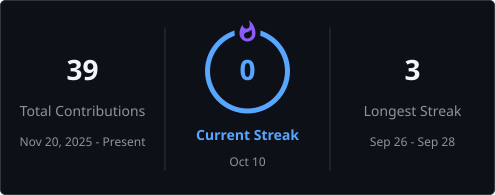
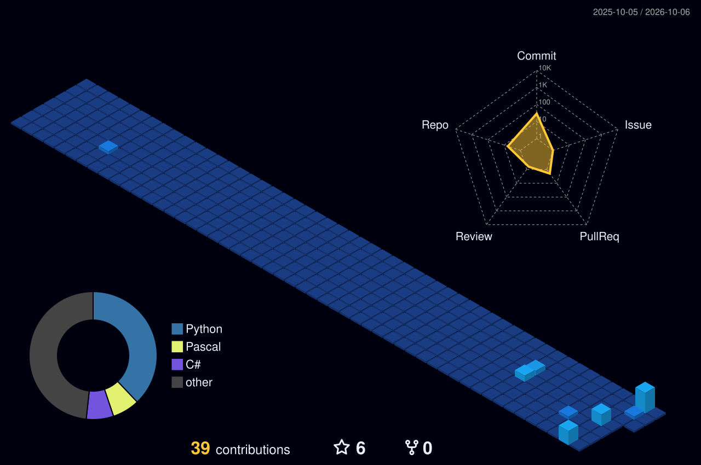

# 31bc

### Software tools · Reverse engineering · Security development

  I'm Shadow — I build command-line tools, analysis utilities and automation. 
  Most of my work is in <b>C#/.NET</b> and <b>Python</b>, focused on static analysis,
  binary inspection and CTF-style problem solving.

 

<h3>My Closest Friends {me}</h3>

---

## GitHub Overview

  
  

---

## Contribution Activity

  

---

## Streak

  

---

## Featured Projects

<table>
  <tr>
    <td width="50%" valign="top">
      <a href="https://github.com/31bc/TE-CMD"><b>TE-CMD</b></a> 
      Portable Windows CLI for static analysis, PE and .NET inspection, decompilation and unpacking of Python packed programs. 
      <code>Python</code> &nbsp;·&nbsp; ★ 1
    </td>
    <td width="50%" valign="top">
      <a href="https://github.com/31bc/HELL-Nuke"><b>HELL-Nuke</b></a> 
      HELL Nuke is a C#/.NET Discord automation toolkit built with Discord.NET. It features an interactive CLI, JSON configuration, asynchronous task processing, batch operations, progress tracking, and Discord API integration - designed for development, administration, and authorized testing environments. 
      <code>C#</code> &nbsp;·&nbsp; ★ 2
    </td>
  </tr>
  <tr>
    <td width="50%" valign="top">
      <a href="https://github.com/31bc/Cheat-Engine"><b>Cheat-Engine</b></a> 
      HELL STORM - Open-source analysis tool for studying competitive game mechanics in isolated test environments. Provides real-time memory reading, advanced data visualization, and interactive simulation to understand system responses. Designed for researchers and developers exploring security boundaries and improving defensive mechanisms. 
      <code>Pascal</code> &nbsp;·&nbsp; ★ 1
    </td>
    <td width="50%" valign="top">
      <a href="https://github.com/31bc/Lock-file"><b>Lock-file</b></a> 
      A C# .NET 9 secure file archive system with encryption, compression, and custom .Shadow format. This is an open-source project. 
      <code>C#</code> &nbsp;·&nbsp; ★ 1
    </td>
  </tr>
  <tr>
    <td width="50%" valign="top">
      <a href="https://github.com/31bc/alpha-C2"><b>alpha-C2</b></a> 
      Alpha C2 - an open-source command-and-control platform built for speed, simplicity, and total capability. One lightweight Go agent runs on Windows, Linux, and macOS with no installation, connecting to a modern web dashboard over a single encrypted channel. 
      <code>Go</code> &nbsp;·&nbsp; ★ 1
    </td>
    <td width="50%" valign="top">
      <a href="https://github.com/31bc?tab=repositories"><b>All repositories</b></a> 
      Browse the full list of public repositories. 
      <code>github.com/31bc</code>
    </td>
  </tr>
</table>

---

## Tech Stack

### Languages & Tools 👨‍💻🛠

| Languages | Frameworks & Platforms | Tools |
| --- | --- | --- |
| C# (.NET) | .NET 9 | Git · GitHub |
| Python | Discord.NET | Visual Studio · VS Code |
| Pascal | Windows | Bash · Linux |
| C / C++ | | ILSpy · de4dot |
| Assembly | | Capstone |

**Security / Reverse Engineering:** PE static analysis · .NET decompilation · packer and protection detection (PyInstaller, Nuitka, PyArmor, Themida/WinLicense, UPX, VMProtect) · entropy and anti-debug analysis · memory analysis

---

## Development Focus

- **Software Development** — command-line tools, libraries and automation
- **Static Analysis** — PE inspection, format detection and machine-readable reporting
- **Reverse Engineering** — decompilation, unpacking and binary analysis
- **Security Tooling** — protection detection and defensive research
- **Automation** — batch processing and scriptable workflows

---

## 3D Contributions

  

---

## GitHub Activity

  

  
  

---

## About Me 💬

### - I'm Shadow, 18 years old.

### 💻 Interests
- 🔹 C# Developer
- 🔹 Python Developer
- 🔹 Reverse Engineering Enthusiast
- 🔹 CTF Player
- 🔹 Always learning low-level internals & binary analysis

### 🎯 Hobbies
- ♟️ Playing Chess
- 🚩 Solving CTF Challenges
- 📚 Reading Novels
- 💻 Building Cool Projects

 

---

## Connect With Me 🌐

---

### 🚩 Favorite Quote

> "Reverse Engineering isn't just breaking things, it's understanding how they work."

---
